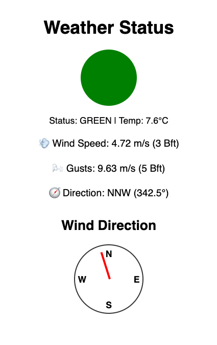

# 🌦 Weather traffic light

This is a full-stack Node.js app that:

- Fetches weather data from the **KNMI EDR API**
- Evaluates it using **json-rules-engine**
- Serves a frontend with a traffic light status (green/orange/red)
- Built with **TypeScript**, **Docker**, and **Express**


---

## 🚀 Features

- 🔧 TypeScript backend with Express
- 🔍 Rule engine for smart evaluations
- 🔗 Fetches 10-minute data from KNMI
- 🚦 Frontend traffic light at `/`
- 🐳 Docker support for containerized deployment

---

## 🛠 Setup

### 1. Clone the project & install dependencies

```bash
npm install
```

### 2. Set your KNMI API Key

Create a `.env` file:

```
KNMI_API_KEY=your_actual_knmi_api_key
```

You can [request a key here](https://developer.dataplatform.knmi.nl/).

---

## 💻 Run Locally

### Development mode (auto-reload)

```bash
npm run dev
```

### Production mode

```bash
npm run build
npm start
```

---

## 🔌 API Endpoint

### `GET /api/weather-status`

Returns the latest weather status and facts:

```json

{
    "temperature":7.6,
    "windSpeed":4.72,
    "windGust":9.63,
    "windDirection":342.5,
    "windSpeedBft":3,
    "windGustBft":5,
    "status":"green"
}
```

---

## 🌐 Frontend (Traffic Light)

Visit [http://localhost:3000/](http://localhost:3000/) to view a visual traffic light based on the weather status.

---

## 🐳 Run with Docker

### Build the image

```bash
docker build -t weer-stoplicht .
```

### Run the container

```bash
docker run -p 3000:3000 --env-file .env weer-stoplicht
```

---

## 🧠 Rules Logic

Located in `src/rules/definitions.ts`, e.g.:

---

## 📝 License

MIT
